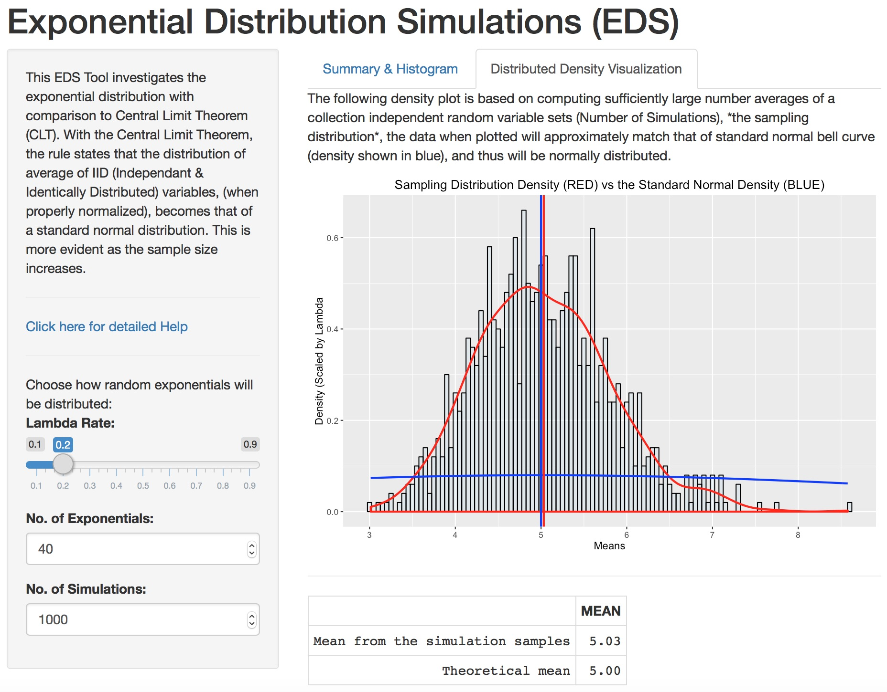
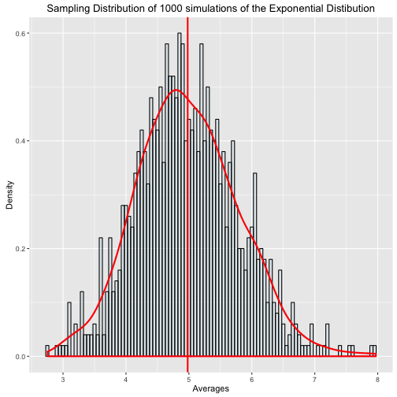

## Motivation Behind the EDS Tool

The EDS Tool investigates the exponential distribution with comparison to Central Limit Theorem (CLT). 

With the Central Limit Theorem, the rule states that the distribution of average of IID (Independant & Identically Distributed) variables, (when properly normalized), becomes that of a standard normal distribution.  This is more evident as the sample size increases.

Also for a sampling distribution to be normal it should statify attributes of a standard normal:

* Where 68% distribution lies within 1 standard deviation from it's distribution mean.
* Secondly, 97% lies within 2 standard deviations awat from from distribution mean.
* Lastly, 99% lies within 3 standard deviations from the distribution mean.

The EDS Tool provides a quick way to run a variety of simulations and test this theory in real-time.  The source material for this tool was based on lectures, notes and homework from Project #1 within Statistic Inference course offered on Coursera.org for the John Hopkin's Data Science Specialization.

--- .class #id 

## EDS TOOL Application



The EDS Tool Application can be accessed at this location: 
[https://smallwesley.shinyapps.io/shinyapp/](https://smallwesley.shinyapps.io/shinyapp/)

--- .class #id 
## Formulas

Within the tool, here are a few of the formulas/functions used within the tool.


```r
# EXPONENTIAL DISTRIBUTION
getExpDist <- function(n, lambda) rexp(n,lambda)

# CALCULATION OF THE THEORECTICAL MEAN
getExpDistMean <- function(lambda) 1/lambda

# CALCULATION OF THE THEORECTICAL VARIANCE
getExpDistStdDev <- function(lambda) 1/lambda

# SIMULATION TO OBTAIN SAMPLES (AVERAGES OF AVERAGES)
getSimulationExpDistMeansDataFrame <- function(n, lambda, nosim) {
  output = NULL
  for (i in 1 : nosim) output = c(output, mean(getExpDist(n=n,lambda=lambda)))
  data.frame(x_axis = output)
}
```

--- .class #id

### Demo of the normal distribution plot provided in the EDS Tool


```r
# Verbose GGPLOT2 code not show; ECHO = FALSE, EVAL = TRUE
exampleExpDistPlot1000
```


